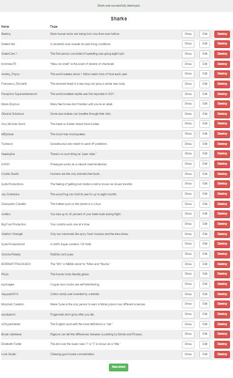
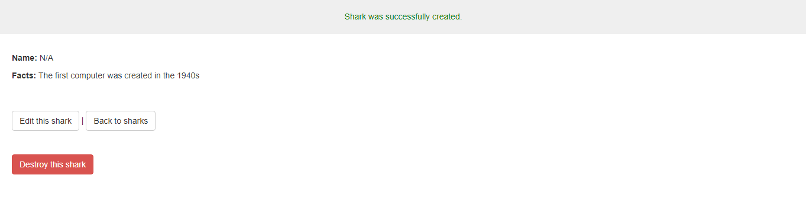
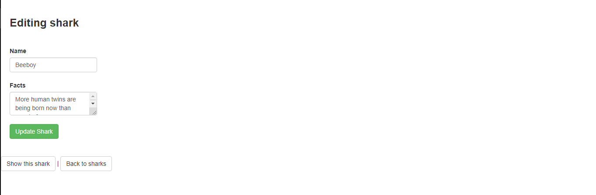

# Sharks_facts
Here in this demo app I have created a fact application that allows users to post facts with thier name included, I have also created few option to the created fact like `Show`: to show the users created facts, `Edit`: to edit and update the users facts and `Destroy`: to delete created facts(WARNING: once deleted you can't restore your facts), Notice that there's a buttom in directly at the bottom in the Sharks home page where you can create new facts.

## views

## Technologies Used

* Language (Ruby on Rails)
* PostgreSQL

## Prerequisites
* A text editor(preferably Visual Studio Code)
* WSL(Ubuntu)

## Installation
* Ruby
* Rails
* Postgresql

## 👤 Author 
Edward Yara :student: 
- GitHub: [@oluyaratosin123](https://github.com/oluyaratosin123)
- Twitter: [@TOluyara](https://twitter.com/TOluyara)
- LinkedIn: [LinkedIn](https://www.linkedin.com/in/edward-oluyara/)

## Contributing :handshake:
Contributions, issues, and feature requests are welcome!

## Show your support
Give a 	:star: if you like this project.

## Acknowledgments
* Hat tip to anyone whose code was used
* Inspiration
* etc

## License :memo:
This project is [MIT](https://github.com/microverseinc/readme-template/blob/master/MIT.md) licensed
